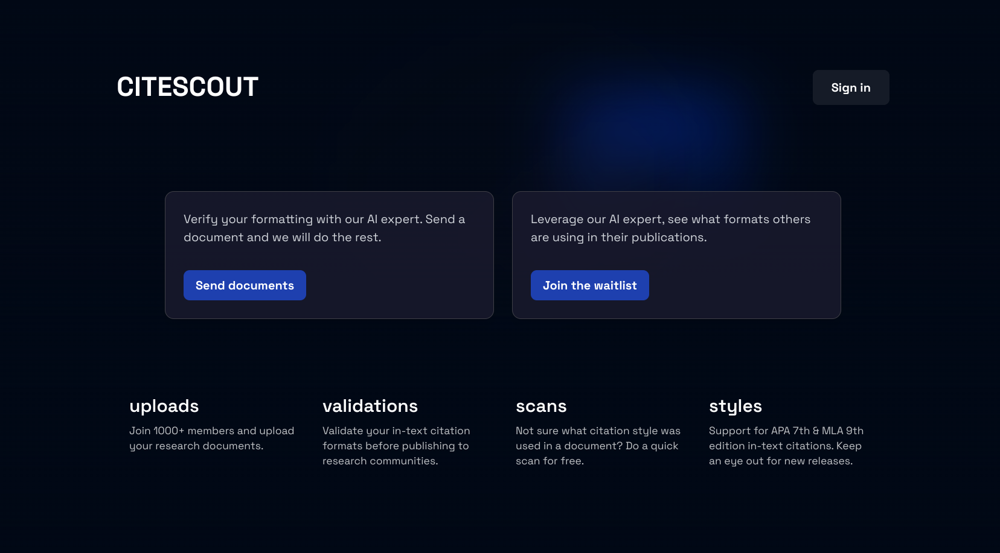
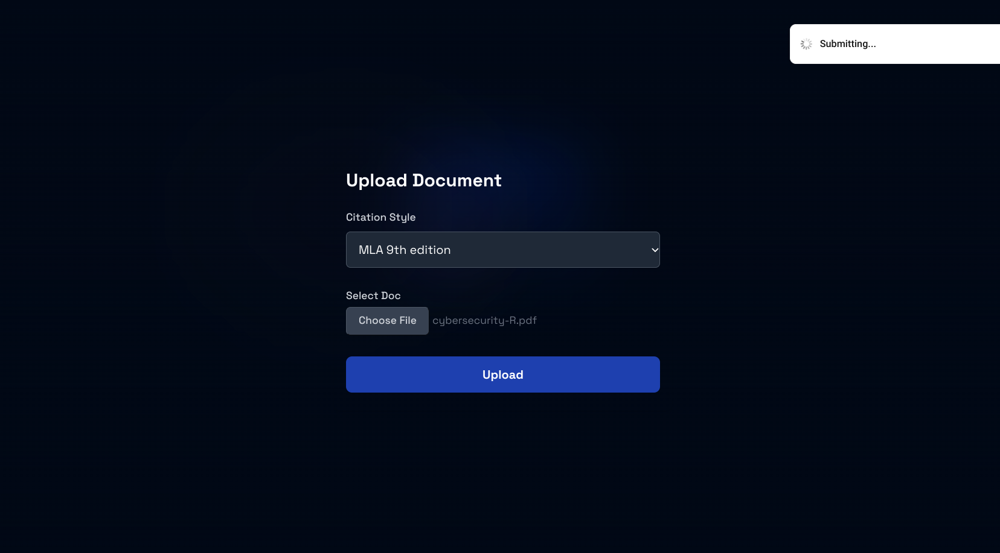
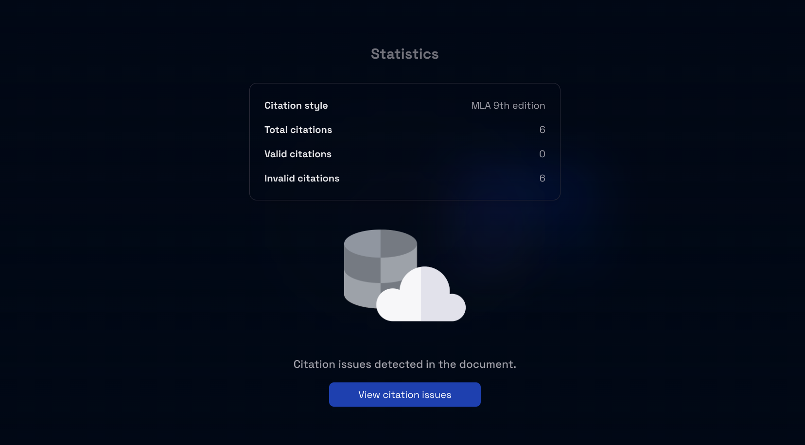
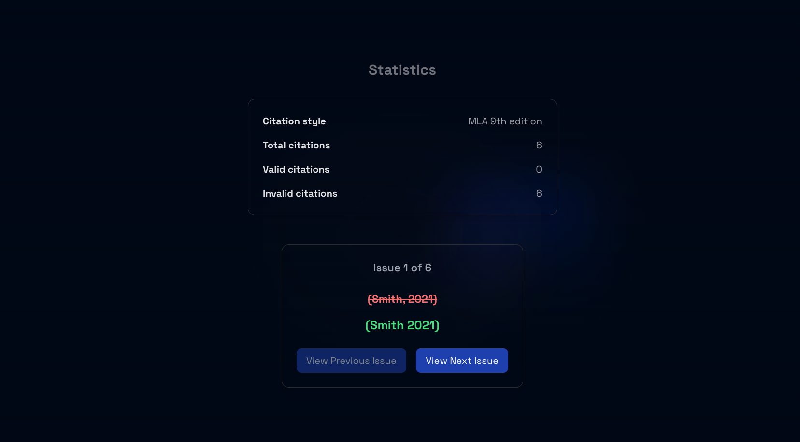

# Citation format validator

Final year project: A research domain project. This applciation allows for upload of research document in .pdf.
It extracts all in-text citations in your document and verifies if they follow a selected format. A cool feature is a statistics
and issues page that renders your errors as well as the correct version to you.

## Table of contents

- [Screenshot](#screenshot)
- [Links](#links)
- [Built with](#built-with)
- [Contribute](#contribute)
- [Author](#author)
- [Acknowledgments](#acknowledgments)

### Screenshot

Onboarding


Upload


Statistics


Issues


### Links

- Solution URL: [Find the project source code on Github](https://github.com/edem8/citeScout)
- Live Site URL: [Interact with App](https://cite-scout.vercel.app/)

### Built with

- Next JS
- Tailwinds
- Vanilla Css
- Mobile-first workflow
- [Typescript](https://typescriptlang.org/) - Statically typed JS

## Contribute

- Create an issue
- Clone the repo and create a branch
- Run

```sh
npm install
```

- Create a pull request

## Authors

- Github - [Kwaku Kwadwo Edem Bless](https://github.com/edem8)
- Twitter - [@eDlaWss](https://www.twitter.com/eDlaWss)
- Role- Backend development

Veronica Amokwandoh- 
Role- Frontend development 

Yeboah Bridget
Role - Project Research 
-LinkedIn- (www.linkedin.com/bridgetyeboah)

Bernice Gardiner 
Role - User interface design 

Philemon Nyarko
Role- User documentation.

## Acknowledgments

Thank you to [University of Ghana](https://dcs.ug.edu.gh/) for kick-starting my Tech journey
